# Hi there! I'm Guitar
### INDIE GAME DEVELOPER | UNITY | C# 

Welcome to my profile! I'm **Wachsirin Sarayutpisai** aka **hisguitar** I'm a passionate indie game developer currently studying at Bangkok University. My dream is to create immersive MMORPGs where players can find their second home.
* 🌍 Based in Thailand
* ✉️ Contact me at [wachsirin.sara@gmail.com](mailto:wachsirin.sara@gmail.com)
* 🚀 Currently showcasing my work on [Itch.io](https://hisguitar.itch.io/)
* 🧠 Constantly honing my skills in Unity, C#, UI Design, and 3D Modeling
* 🤝 Open to collaborations on MMORPG projects

---

### EDUCATION
**[Bangkok University](https://www.bu.ac.th/th) | August 2021 - December 2024**  
School of Information Technology and Innovation  
Games and Interactive Media  
Cum GPA: 3.70

**[Hatyairatprachasun School](http://www.hatyairat.ac.th/) | May 2018 - April 2021**  
English and Math  
Cum GPA: 3.11

---

## 💻 HARD SKILLS

**Programming & Game Dev**  
- Unity (2D, 3D, VR, Mobile)  
- C#  
- Multiplayer Networking (Photon, Netcode)  
- Game AI (Behavior Control, Triggers, Events)  
- Procedural Generation  
- UX/UI Design  
- Git & GitHub  
- Firebase  

**Art & Design**  
- Adobe Photoshop, Illustrator, Premiere Pro, After Effects  
- Autodesk Maya  
- Substance Painter  
- Figma  

**Other Tools**  
- Shader Graph  
- Unity Timeline & Cinemachine  
- Trello & Agile Workflow  

---

## 🌱 SOFT SKILLS
- Critical Thinking & Problem Solving  
- Fast Learner & Self-Motivated  
- Communication & Team Collaboration  
- Time Management & Prioritization  
- Creative Presentation Skills  

---
# 🏅 CERTIFICATES

  
  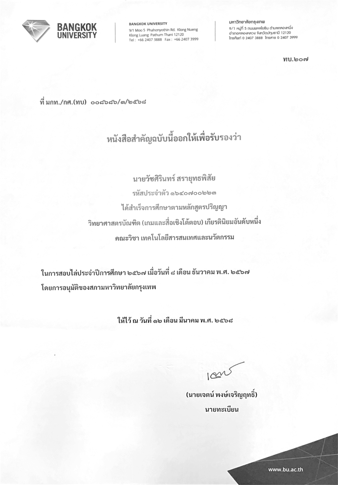
  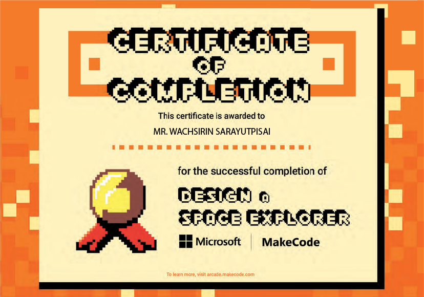

---

## EXPERIENCE IN GAME DEVELOPMENT
## 🧙‍♂️ Ethera (Multiplayer Game)
* 2D top-down multiplayer RPG developed with friends.
* Key contributions is **Implemented multiplayer mode and chat system, Designed and create character customization features, Developed combat mechanics for both PvE and PvP**
* You can [download it from Itch.io](https://hisguitar.itch.io/ethera) and unzip the files or play it directly on the website.  
<a href="https://hisguitar.itch.io/ethera">
  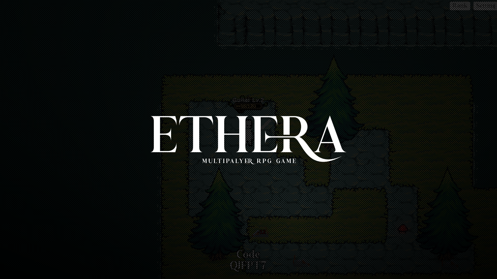
</a>

## 🧙‍♂️ Willow The Little Witch (My first project)
* 2D Side-Scrolling Action Game.
* Key contributions is **Designed enemy AI, Set up lighting and sound systems, Sound Manager System, Managed scene transitions**
* This is my first game developed using C# and Unity Engine.
* You can [download it from Itch.io](https://hisguitar.itch.io/willow) and unzip the files or play it directly on the website.  
  (Downloading is recommended for the best gaming experience.)
* [You can view my GDD here](https://github.com/hisguitar/willow)
<a href="https://hisguitar.itch.io/willow">
  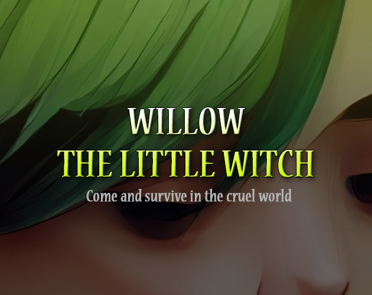
</a>

## 🌟 Portal Strike (Mobile Game)
* 3D Rogue-like, run & gun game.
* Key contributions is **Implemented ability selection cards and random card system, Designed portal skill (Dash, Decoy), Developed RPG stats and upgrade system, Procedural Map Generation**
* This is a collaborative project with two teammates. [qiqitaro](https://github.com/cheqii) & [loneguss](https://github.com/loneguss)
* You can [download it from Itch.io](https://hisguitar.itch.io/portal-strike) and unzip the files.
<a href="https://hisguitar.itch.io/portal-strike">
  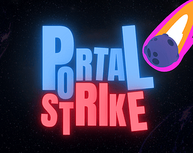
</a>

## 🎃 Forest Quest (VR Game)
* 3D VR horror single-player game.
* Key contributions is **Implemented location-based triggered dialogs, Design and create ghost event activations, Developed behavioral patterns for triggered ghosts**
* This is a collaborative project with two teammates. [qiqitaro](https://github.com/cheqii) & [loneguss](https://github.com/loneguss)
* Gameplay videos can be [viewed on YouTube](https://youtu.be/P7xZljkSM3Q?si=lK7ubU4eHmOwwfuc).
<a href="https://youtu.be/P7xZljkSM3Q?si=lK7ubU4eHmOwwfuc">
  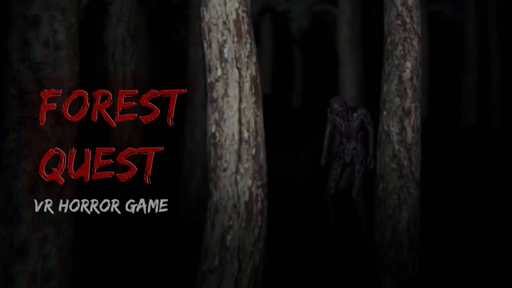
</a>

## ⚔ Silly Battle (Global Game Jam 2024)
* 2D action versus, local co-op game.
* Key contributions is **Designed a slot machine for random weapon selection, Implemented local co-op gameplay, Developed diverse weapon with unique abilities**
* This is a collaborative project with two teammates. [qiqitaro](https://github.com/cheqii) & [loneguss](https://github.com/loneguss)
* This game was created by DUCK 4U group at [GGJ2024 (Site Rangsit)](https://globalgamejam.org/jam-sites/2024/rangsit-university) under the theme “Make me laugh”.
* [Our game ranked](https://web.facebook.com/ThaiGameJam/videos/393072943374390/) 2nd with 16 votes.
* You can [download it from Itch.io](https://qiqitaro.itch.io/silly-battle) and unzip the files or play it directly on the website.
<a href="https://qiqitaro.itch.io/silly-battle">
  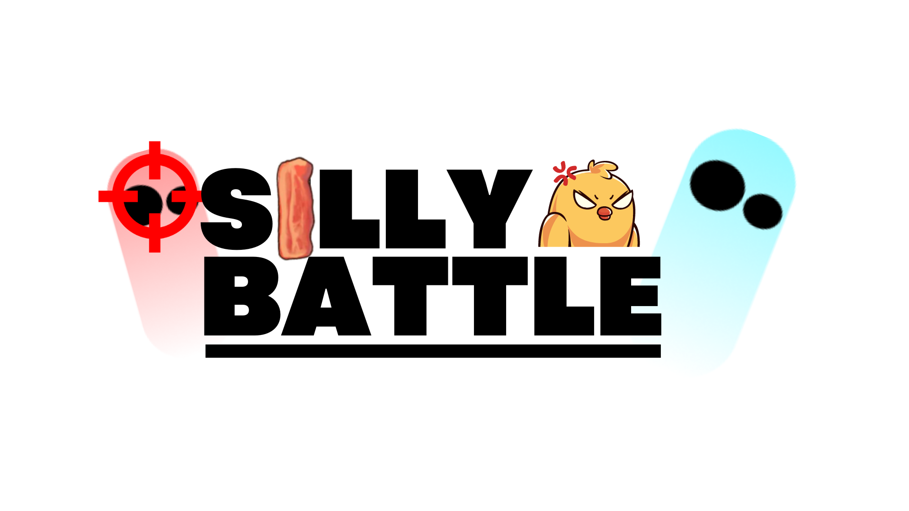
</a>

---

# EXPERIENCE IN GRAPHIC DESIGNER & PHOTO EDITOR
## Game Cover: Quartz Core
This is the game cover that I photographed and edited by myself. It's from a game project I developed during my 3-month internship at Wolveden Production as a Unity Developer.

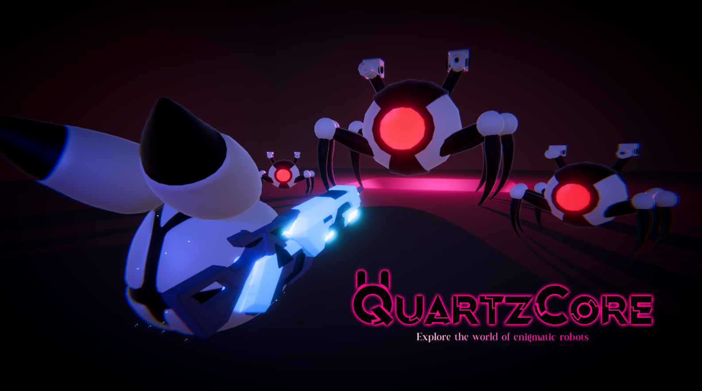

---

# EXPERIENCE IN 3D MODELING
## Bedroom
This is a project I worked on during my 2nd year at Bangkok University. The project was to create any room that I wanted, so I chose to sculpt my bedroom. I meticulously measured almost everything in it. It was quite challenging, but also very fun! 😄

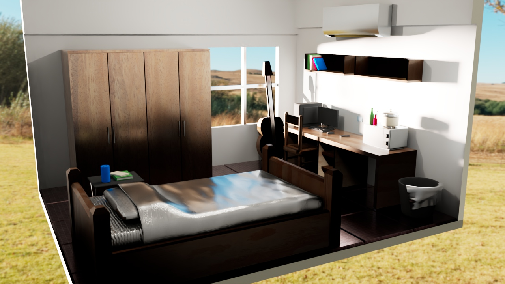
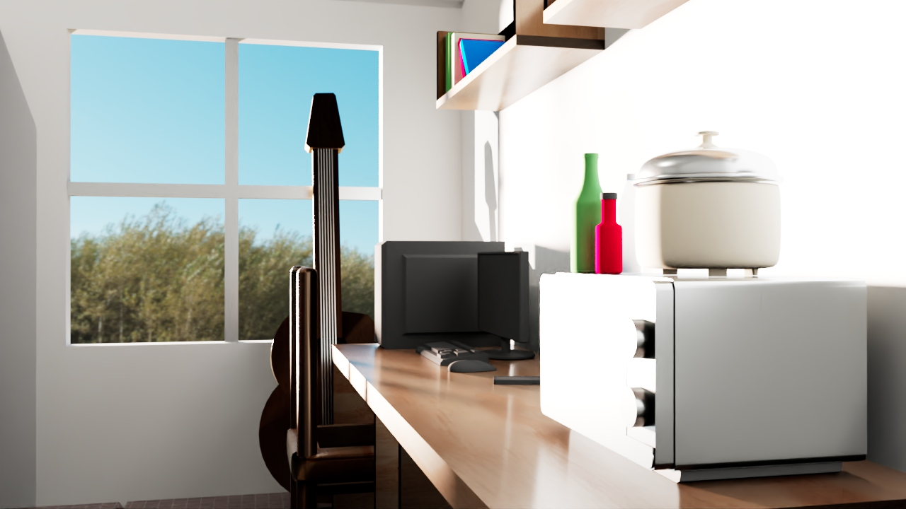
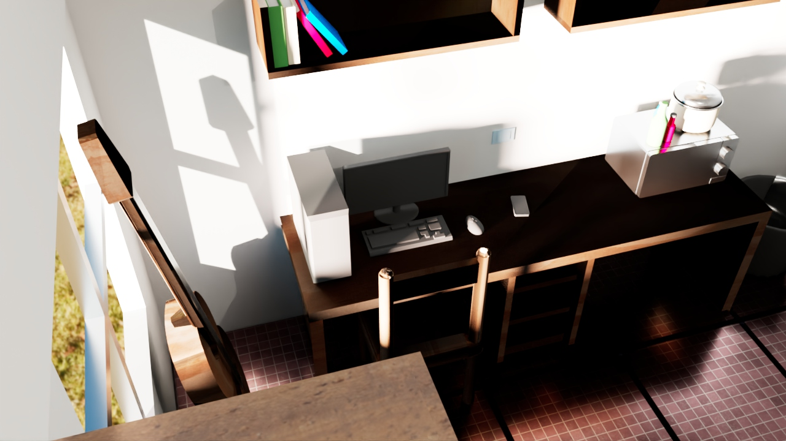

## P90 Gun
The project was to sculpt any weapon, so I chose something I wasn't very familiar with: a gun. I thought it might be a good opportunity to learn about design, as I typically play a lot of RPG games and rarely touch FPS games.
[P90 gun model, displayed in a 360 degree view](https://www.youtube.com/watch?v=DN2iyGtyXkE)

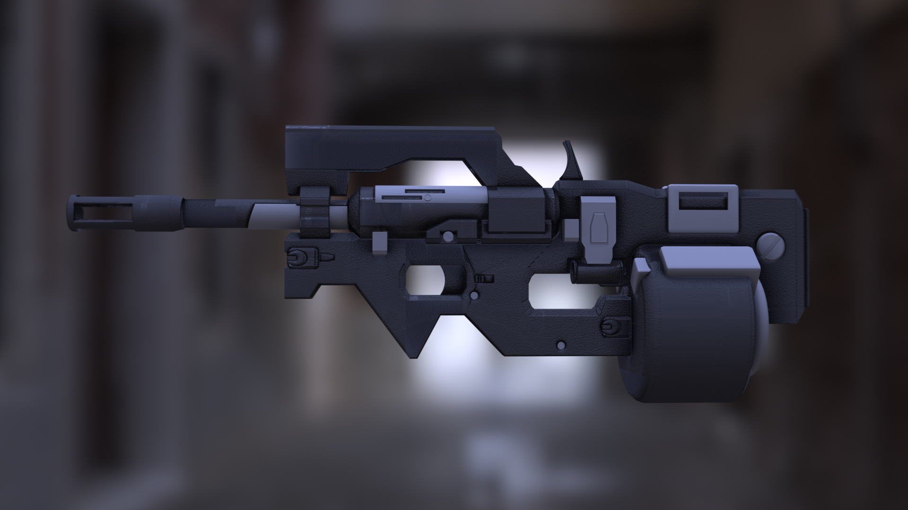

## [War Spaceship](https://hisguitar.itch.io/warspaceship)
The project was to sculpt any vehicle + animation of it, So I chose the most dynamic thing to animate, a war spaceship, because I thought the shooting and movement would be more dynamic than the other vehicles.
You can find [more details about this project on Itch.io](https://hisguitar.itch.io/warspaceship), and you can support me there as well.

<a href="https://hisguitar.itch.io/warspaceship">
  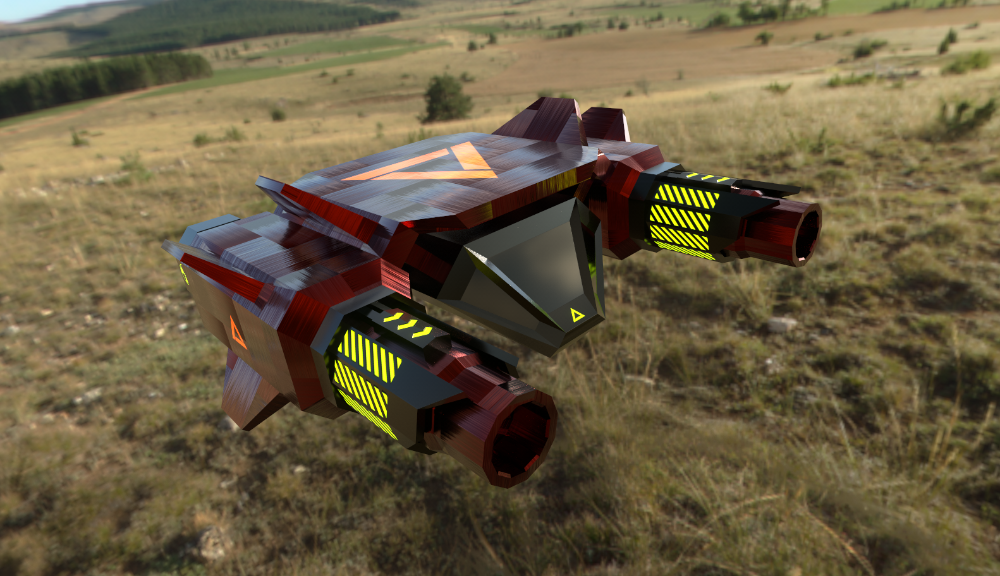
</a>
