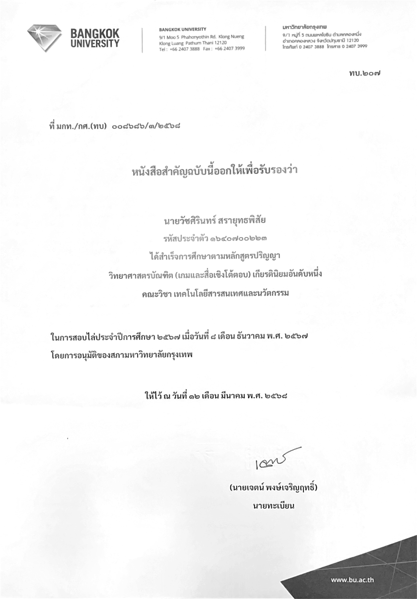
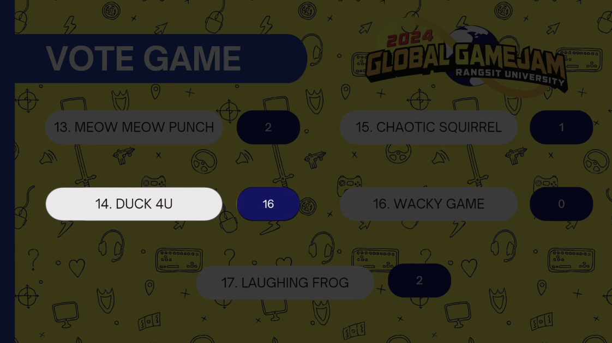

# Hi there! I'm Guitar
### INDIE GAME DEVELOPER | UNITY | C# 

Welcome to my profile! I'm **Wachsirin Sarayutpisai** aka **hisguitar** I'm a passionate indie game developer currently studying at Bangkok University. My dream is to create immersive MMORPGs where players can find their second home.
* 🌍 Based in Thailand
* ✉️ Contact me at [wachsirin.sara@gmail.com](mailto:wachsirin.sara@gmail.com)
* 🚀 Currently showcasing my work on [Itch.io](https://hisguitar.itch.io/)
* 🧠 Constantly honing my skills in Unity, C#, UI Design, and 3D Modeling
* 🤝 Open to collaborations on MMORPG projects

---

### EDUCATION
**[Bangkok University](https://www.bu.ac.th/th) | August 2021 - December 2024**  
School of Information Technology and Innovation  
Games and Interactive Media  
Cum GPA: 3.71 (First-class) 🏅

**[Hatyairatprachasun School](http://www.hatyairat.ac.th/) | May 2018 - April 2021**  
English and Math  
Cum GPA: 3.11

---

### WORK EXPERIENCE
**[Starbucks](https://www.facebook.com/StarbucksThailand) | Barista | July 2025 - Current**  
Responsibilities:
- ⭐️ Customer Service & Sales: Provide professional customer service with a positive attitude, recommend seasonal drinks and pastries, communicate promotions and product updates, and consistently achieve daily sales targets.
- ⭐️ Beverage & Product Management: Prepare beverages according to company standards, manage stock levels, check expiry dates, and ensure product freshness and availability.
- ⭐️ Store Operations: Perform store opening and closing duties, handle receiving and transferring products between branches, and refill front-store items as needed.
- ⭐️ Cleanliness & Standards: Maintain store cleanliness, organization, and complete task-list responsibilities efficiently in line with company standards.

**[ArtSticker Design](https://www.facebook.com/ArtStickerDesign) | Graphic Designer | March 2025 - April 2025**  
Responsibilities:
- ⭐️ Communicate with customers to understand their requirements and provide design solutions.
- ⭐️ Design car stickers, car wraps, front car decals, banners, and promotional materials.
- ⭐️ Create logos for shops and businesses.
- ⭐️ Coordinate with teammates to ensure accurate measurements before design and cutting.
- ⭐️ Operate and manage the sticker cutting machine, from preparation to cutting.
- ⭐️ Prepare stickers and protective films for installation teams to use efficiently.
- ⭐️ Edit photos and enhance images using Illustrator and Photoshop.
- ⭐️ Photograph and edit customer cars after sticker/film installation for promotional use.
- ⭐️ Post daily works and updates on the company’s Facebook page for marketing purposes.

**Innotel Corporation Co. Ltd. | Kitchen Assistant | September 2024 - November 2024**  
Responsibilities:
- ⭐️ Prepare ingredients for daily food preparation.
- ⭐️ Cook and assemble dishes, then deliver them to the conveyor belt.
- ⭐️ Purchase supplies for the restaurant and issue tax invoices.
- ⭐️ Guide and train new staff to ensure smooth onboarding.

**[WolvEden Production Co. Ltd.](https://www.facebook.com/WolvEdenProduction) | Unity Developer | May 2024 - August 2024**  
Responsibilities / Achievements:
- ⭐️ Gained knowledge in game development using C# and Unity Engine, applying SOLID principles, attributes, and state patterns.
- ⭐️ Designed and programmed core gameplay systems including Combo System, Enemy AI (with parent-child hierarchy and wall-climbing spiders), item drops, and settings (graphics/audio).
- ⭐️ Built maps with NavMesh for intelligent AI patrol and chase behaviors.
- ⭐️ Contributed to game art and design by creating Game Design Documents (GDDs) and modeling thematic in-game items.
- ⭐️ Collaborated in teams by planning tasks, setting daily goals, and reporting progress to maintain alignment.
- ⭐️ Participated in company game jams, creating multiplayer cooperative games within a 7-day timeframe.

---

## 💻 HARD SKILLS

**Programming & Game Dev**  
- ⭐️ Unity (2D, 3D, VR, Mobile)  
- ⭐️ C#  
- ⭐️ Multiplayer Networking (Photon, Netcode)  
- ⭐️ Game AI (Behavior Control, Triggers, Events)  
- ⭐️ Procedural Generation  
- ⭐️ UX/UI Design  
- ⭐️ Git & GitHub  
- ⭐️ Firebase  

**Art & Design**  
- ⭐️ Adobe Photoshop, Illustrator, Premiere Pro, After Effects  
- ⭐️ Autodesk Maya  
- ⭐️ Substance Painter  
- ⭐ Figma  

**Other Tools**  
- ⭐️ Shader Graph  
- ⭐️ Unity Timeline & Cinemachine  
- ⭐️ Trello & Agile Workflow  

---

## 🌱 SOFT SKILLS
- ⭐️ Critical Thinking & Problem Solving  
- ⭐️ Fast Learner & Self-Motivated  
- ⭐️ Communication & Team Collaboration  
- ⭐️ Time Management & Prioritization  
- ⭐️ Creative Presentation Skills  

---
# 🏅 CERTIFICATES

  
  
  
  

---

## EXPERIENCE IN GAME DEVELOPMENT
## 🧙‍♂️ Ethera (Multiplayer Game)
* 2D top-down multiplayer RPG developed with friends.
* Key contributions is **Implemented multiplayer mode and chat system, Designed and create character customization features, Developed combat mechanics for both PvE and PvP**
* You can [download it from Itch.io](https://hisguitar.itch.io/ethera) and unzip the files or play it directly on the website.  

## 🧙‍♂️ Willow The Little Witch (My first project)
* 2D Side-Scrolling Action Game.
* Key contributions is **Designed enemy AI, Set up lighting and sound systems, Sound Manager System, Managed scene transitions**
* This is my first game developed using C# and Unity Engine.
* You can [download it from Itch.io](https://hisguitar.itch.io/willow) and unzip the files or play it directly on the website.  
  (Downloading is recommended for the best gaming experience.)
* [You can view my GDD here](https://github.com/hisguitar/willow)

## 🌟 Portal Strike (Mobile Game)
* 3D Rogue-like, run & gun game.
* Key contributions is **Implemented ability selection cards and random card system, Designed portal skill (Dash, Decoy), Developed RPG stats and upgrade system, Procedural Map Generation**
* This is a collaborative project with two teammates. [qiqitaro](https://github.com/cheqii) & [loneguss](https://github.com/loneguss)
* You can [download it from Itch.io](https://hisguitar.itch.io/portal-strike) and unzip the files.

## 🎃 Forest Quest (VR Game)
* 3D VR horror single-player game.
* Key contributions is **Implemented location-based triggered dialogs, Design and create ghost event activations, Developed behavioral patterns for triggered ghosts**
* This is a collaborative project with two teammates. [qiqitaro](https://github.com/cheqii) & [loneguss](https://github.com/loneguss)
* Gameplay videos can be [viewed on YouTube](https://youtu.be/P7xZljkSM3Q?si=lK7ubU4eHmOwwfuc).

## ⚔ Silly Battle (Global Game Jam 2024)
* 2D action versus, local co-op game.
* Key contributions is **Designed a slot machine for random weapon selection, Implemented local co-op gameplay, Developed diverse weapon with unique abilities**
* This is a collaborative project with two teammates. [qiqitaro](https://github.com/cheqii) & [loneguss](https://github.com/loneguss)
* This game was created by DUCK 4U group at [GGJ2024 (Site Rangsit)](https://globalgamejam.org/jam-sites/2024/rangsit-university) under the theme “Make me laugh”.
* [Our game ranked](https://web.facebook.com/ThaiGameJam/videos/393072943374390/) 2nd with 16 votes.
* You can [download it from Itch.io](https://qiqitaro.itch.io/silly-battle) and unzip the files or play it directly on the website.

---

# EXPERIENCE IN GRAPHIC DESIGNER & PHOTO EDITOR
## Game Cover: Quartz Core
This game cover was both photographed and edited by me as part of a project I developed during my 3-month internship at Wolveden Production, where I worked as a Unity Developer. The design reflects the game's core concept and visual identity.

## Logo & Car Wrap Design: Slide-Car
This is a logo and custom car wrap pattern I designed while working as a graphic designer. The project required combining branding elements with real-world application on a vehicle, blending visual appeal with functionality.

## Benz E63 AMG – Comic Style Illustration
As part of my graphic design work, I transformed a photo of a Benz E63 AMG into a comic-style illustration. This piece showcases my ability to merge realistic imagery with stylized digital effects for creative visual storytelling.

---

# EXPERIENCE IN 3D MODELING
## Bedroom
This is a project I worked on during my 2nd year at Bangkok University. The project was to create any room that I wanted, so I chose to sculpt my bedroom. I meticulously measured almost everything in it. It was quite challenging, but also very fun! 😄

## P90 Gun
The project was to sculpt any weapon, so I chose something I wasn't very familiar with: a gun. I thought it might be a good opportunity to learn about design, as I typically play a lot of RPG games and rarely touch FPS games.
[P90 gun model, displayed in a 360 degree view](https://www.youtube.com/watch?v=DN2iyGtyXkE)

## [War Spaceship](https://hisguitar.itch.io/warspaceship)
The project was to sculpt any vehicle + animation of it, So I chose the most dynamic thing to animate, a war spaceship, because I thought the shooting and movement would be more dynamic than the other vehicles.
You can find [more details about this project on Itch.io](https://hisguitar.itch.io/warspaceship), and you can support me there as well.

## Living room shelves.

## 15kg. Dumbbells
Reference: https://s.shopee.co.th/3AvbpY8hfc

