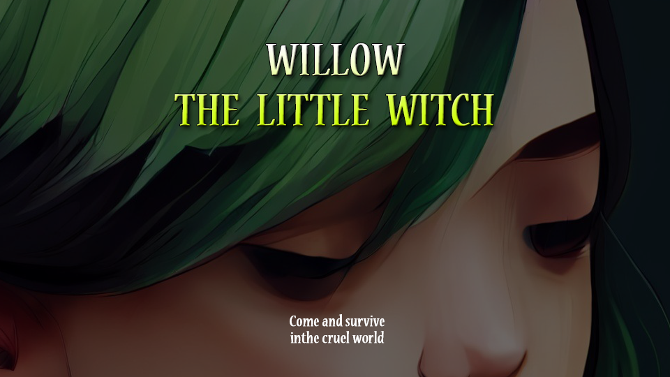

# Hi there! 👋 I'm Wachsirin Sarayutpisai (Guitar)
## Indie Game Developer | Unity | C# 

Welcome to my profile! I'm a passionate indie game developer currently studying at Bangkok University. My dream is to create immersive MMORPGs where players can find their second home.
* 🌍 Based in Thailand
* ✉️ Contact me at [wachsirin.sara@gmail.com](mailto:wachsirin.sara@gmail.com)
* 🚀 Currently showcasing my work on [Itch.io](https://hisguitar.itch.io/)
* 🧠 Constantly honing my skills in Unity, C#, UI Design, and 3D Modeling
* 🤝 Open to collaborations on MMORPG projects

## Skills 

  
  
  
  
  
  
  
  
  
  

## My Games
### :pushpin: Willow The Little Witch | 2D Action Platform game
To play my first game ****'Willow The Little Witch'****, simply [download it from Itch.io](https://hisguitar.itch.io/willow) and unzip the files or play it directly on the website.  
(Downloading is recommended for the best gaming experience.)

  <kbd>
    
  </kbd>

### :pushpin: Portal Strike | 3D Roguelike, Run & Gun game 
To play my second game ****'Portal Strike'****, simply [download it from Itch.io](https://hisguitar.itch.io/portal-strike) and unzip the files.

  <kbd>
    
  </kbd>

### :pushpin: Silly Battle | 2D Action Versus, Local co-op game
To play my third game ****'Silly Battle'****, simply [download it from Itch.io](https://qiqitaro.itch.io/silly-battle) and unzip the files or play it directly on the website.

  <kbd>
    
  </kbd>

