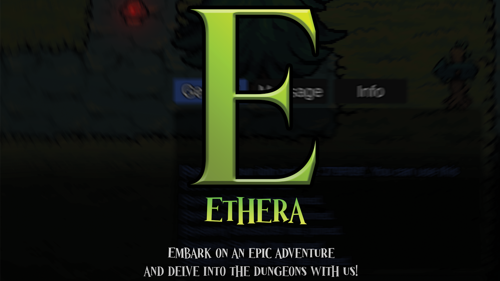
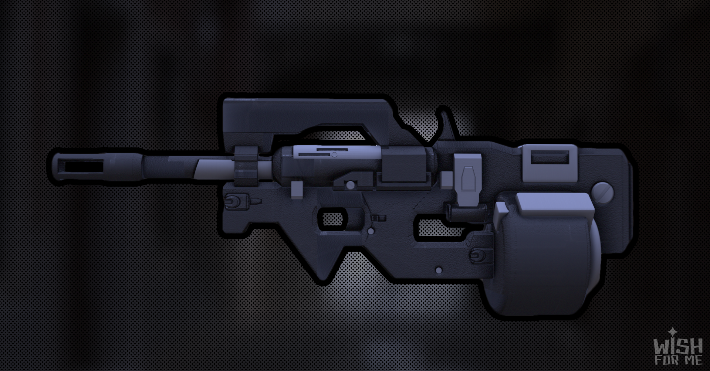
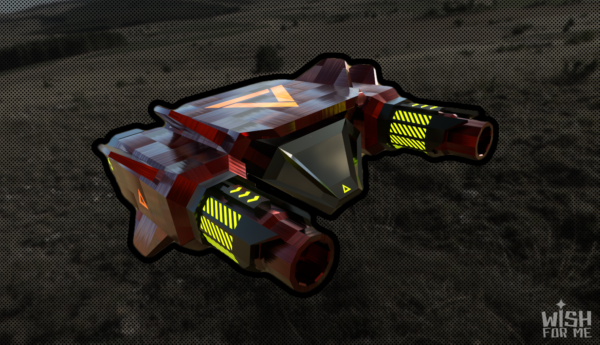

# Hi there! 👋 I'm Guitar
### INDIE GAME DEVELOPER | UNITY | C# 

Welcome to my profile! I'm **Wachsirin Sarayutpisai** aka **hisguitar** I'm a passionate indie game developer currently studying at Bangkok University. My dream is to create immersive MMORPGs where players can find their second home.
* 🌍 Based in Thailand
* ✉️ Contact me at [wachsirin.sara@gmail.com](mailto:wachsirin.sara@gmail.com)
* 🚀 Currently showcasing my work on [Itch.io](https://hisguitar.itch.io/)
* 🧠 Constantly honing my skills in Unity, C#, UI Design, and 3D Modeling
* 🤝 Open to collaborations on MMORPG projects

### EDUCATION
**[Bangkok University](https://www.bu.ac.th/th) | August 2021 - February 2024**  
School of Information Technology and Innovation  
Games and Interactive Media  
Cum GPA: 3.65

**[Hatyairatprachasun School](http://www.hatyairat.ac.th/) | May 2018 - April 2021**  
English and Math  
Cum GPA: 3.11

### HARD SKILLS
* Proficient in Adobe Photoshop
* Proficient in Adobe Premiere Pro
* Intermediate in Adobe Illustrator
* Intermediate in Adobe After Effects
* Intermediate in C#
* Intermediate in Unity
* Intermediate in GitHub
* Intermediate in Maya
* Intermediate in Substance Painter
* Intermediate in Firebase
* Intermediate in Figma

### SOFT SKILLS
* Teamwork
* Learning and Adaptability
* Critical Thinking
* Time Management
* Personal Success
* Presentation

# PROJECT EXPERIENCE
## 🧙‍♂️ [Ethera](https://hisguitar.itch.io/ethera) (Multiplayer Game)
* 2D top-down multiplayer game.
* Highlight of work is **It's multiplayer game, You can customize characters and name them, You can fight both monsters and other players, You can hide behind a tree**
* You can [download it from Itch.io](https://hisguitar.itch.io/ethera) and unzip the files or play it directly on the website.  

## 🧙‍♂️ [Willow The Little Witch](https://hisguitar.itch.io/willow) (Solo Dev)
* 2D Side-scrolling action game.
* Highlight of work is **Clever Enemy, Lighting Setup, Sound Manager System, Scene Manager System**
* This is my first game developed using C# and Unity Engine.
* You can [download it from Itch.io](https://hisguitar.itch.io/willow) and unzip the files or play it directly on the website.  
  (Downloading is recommended for the best gaming experience.)
* [You can view my GDD here](https://github.com/hisguitar/willow)

## 🌟 [Portal Strike](https://hisguitar.itch.io/portal-strike) (Mobile Game)
* 3D rogue-like, run & gun game.
* Highlight of work is **Ability Selection Cards, Random Card, Portal Skills, RPG Stats & Stats Upgrade, Procedural Map Generation**
* This is a collaborative project with two teammates. [qiqitaro](https://github.com/cheqii) & [loneguss](https://github.com/loneguss)
* You can [download it from Itch.io](https://hisguitar.itch.io/portal-strike) and unzip the files.

## 🎃 [Forest Quest](https://youtu.be/P7xZljkSM3Q?si=lK7ubU4eHmOwwfuc) (VR Game)
* 3D VR horror single-player game.
* Highlight of work is **Implementation of triggered dialogs based on different locations, Activation of ghost events, Implementation of various behavioral patterns for triggered ghosts**
* This is a collaborative project with two teammates. [qiqitaro](https://github.com/cheqii) & [loneguss](https://github.com/loneguss)
* Gameplay videos can be [viewed on YouTube](https://youtu.be/P7xZljkSM3Q?si=lK7ubU4eHmOwwfuc).

## ⚔ [Silly Battle](https://qiqitaro.itch.io/silly-battle) (Global Game Jam 2024)
* 2D action versus, local co-op game.
* Highlight of work is **Slot Machine, Random Items, Local co-op, Faction changing system**
* This is a collaborative project with two teammates. [qiqitaro](https://github.com/cheqii) & [loneguss](https://github.com/loneguss)
* This game was created by DUCK 4U group at [GGJ2024 (Site Rangsit)](https://globalgamejam.org/jam-sites/2024/rangsit-university) under the theme “Make me laugh”.
* [Our game ranked](https://web.facebook.com/ThaiGameJam/videos/393072943374390/) 2nd with 16 votes.
* You can [download it from Itch.io](https://qiqitaro.itch.io/silly-battle) and unzip the files or play it directly on the website.

# EXPERIENCE IN 3D MODELING
## Bedroom
This is a project I worked on during my 2nd year at Bangkok University. The project was to create any room that I wanted, so I chose to sculpt my bedroom. I meticulously measured almost everything in it. It was quite challenging, but also very fun! 😄

## P90 Gun
The project was to sculpt any weapon, so I chose something I wasn't very familiar with: a gun. I thought it might be a good opportunity to learn about design, as I typically play a lot of RPG games and rarely touch FPS games.
[P90 gun model, displayed in a 360 degree view](https://www.youtube.com/watch?v=DN2iyGtyXkE)

## [War Spaceship](https://hisguitar.itch.io/warspaceship)
The project was to sculpt any vehicle + animation of it, So I chose the most dynamic thing to animate, a war spaceship, because I thought the shooting and movement would be more dynamic than the other vehicles.
You can find [more details about this project on Itch.io](https://hisguitar.itch.io/warspaceship), and you can support me there as well.

