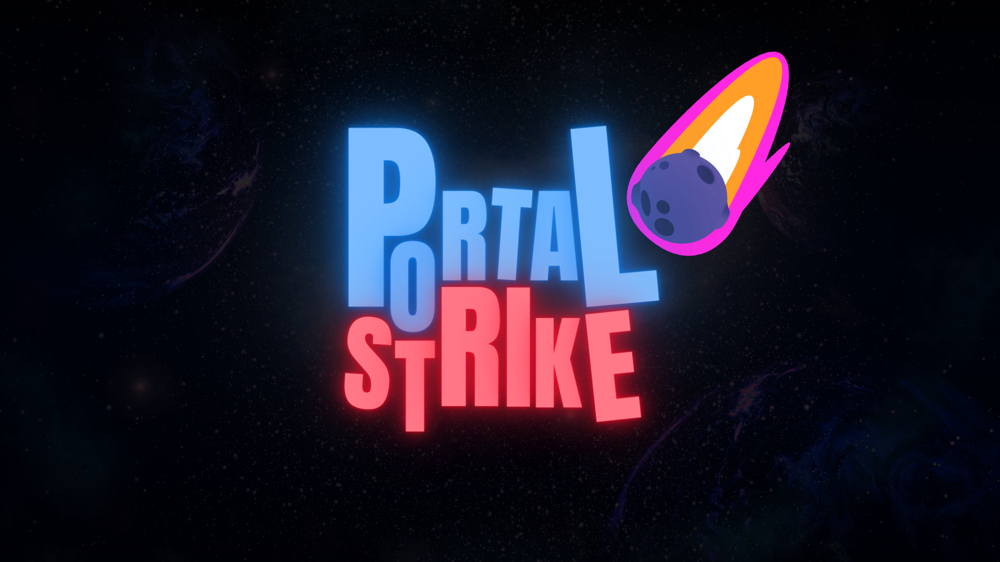

# Hi there! 👋 I'm Guitar
### Indie Game Developer | Unity | C# 

Welcome to my profile! I'm **Wachsirin Sarayutpisai** aka **hisguitar** I'm a passionate indie game developer currently studying at Bangkok University. My dream is to create immersive MMORPGs where players can find their second home.
* 🌍 Based in Thailand
* ✉️ Contact me at [wachsirin.sara@gmail.com](mailto:wachsirin.sara@gmail.com)
* 🚀 Currently showcasing my work on [Itch.io](https://hisguitar.itch.io/)
* 🧠 Constantly honing my skills in Unity, C#, UI Design, and 3D Modeling
* 🤝 Open to collaborations on MMORPG projects

### Skills
* Proficient in Adobe Photoshop
* Proficient in Adobe Premiere Pro
* Intermediate in Adobe Illustrator
* Intermediate in Adobe After Effects
* Intermediate in C#
* Intermediate in Unity
* Intermediate in Maya
* Intermediate in Firebase
* Intermediate in Figma

  
  
  
  
  
  
  
  
  

# MY GAMES
### 🧙‍♂️ [WILLOW THE LITTLE WITCH](https://hisguitar.itch.io/willow)
* 2D Side-scrolling action game.
* Highlight of work is **Clever Enemy, Lighting Setup, Sound Manager System, Scene Manager System**
* This is my first game developed using C# and Unity Engine.
* You can [download it from Itch.io](https://hisguitar.itch.io/willow) and unzip the files or play it directly on the website.  
  (Downloading is recommended for the best gaming experience.)

  <kbd>
    
  </kbd>

### 🌟 [PORTAL STRIKE](https://hisguitar.itch.io/portal-strike)
* 3D rogue-like, run & gun game.
* Highlight of work is **Ability Selection Cards, Random Card, Portal Skills, RPG Stats & Stats Upgrade, Procedural Map Generation**
* This is a collaborative project with two teammates. [qiqitaro](https://github.com/cheqii) & [loneguss](https://github.com/loneguss)
* You can [download it from Itch.io](https://hisguitar.itch.io/portal-strike) and unzip the files.

  <kbd>
    
  </kbd>

### ⚔ [SILLY BATTLE](https://qiqitaro.itch.io/silly-battle)
* 2D action versus, local co-op game.
* Highlight of work is **Slot Machine, Random Items, Local co-op, Faction changing system**
* This is a collaborative project with two teammates. [qiqitaro](https://github.com/cheqii) & [loneguss](https://github.com/loneguss)
* This game was created by DUCK 4U group at [GGJ2024 (Site Rangsit)](https://globalgamejam.org/jam-sites/2024/rangsit-university) under the theme “Make me laugh”.
* [Our game ranked](https://web.facebook.com/ThaiGameJam/videos/393072943374390/) second with 16 votes.
* You can [download it from Itch.io](https://qiqitaro.itch.io/silly-battle) and unzip the files or play it directly on the website.

  <kbd>
    
  </kbd>

